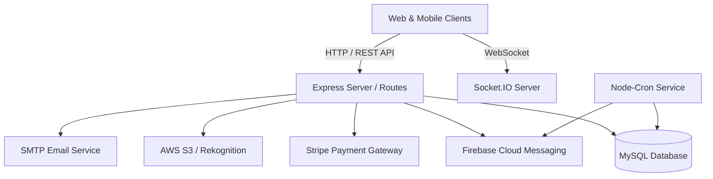
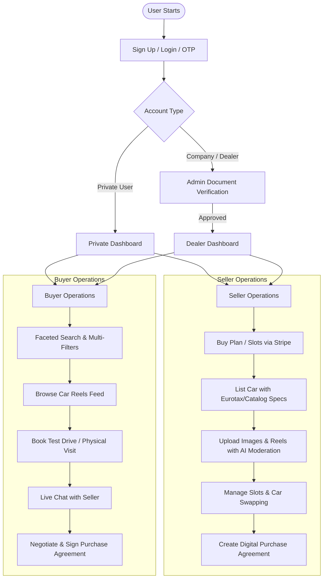
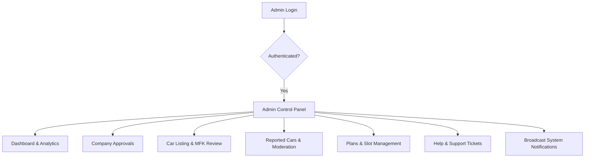

# 🚗 Car Zone - Complete System Documentation & Architecture Guide

---

## 📌 1. Project Overview & System Architecture

**Car Zone** ek high-end automotive marketplace backend platform hai jo European/Swiss market ke requirements ke mutabiq build kiya gaya hai. Isme multi-language support (English, German, French, Italian), Swiss Francs (CHF) currency, Swiss legal car sales regulations (MFK Inspection & Art. 210 CO Warranty), real-time live chat, dynamic reels, and subscription slot management shamil hain.

### 🛠️ Technology Stack Breakdown:
- **Runtime & Framework:** Node.js (ES Modules), Express.js
- **Database:** MySQL (Relational DB with connection pooling & utility promisify)
- **Real-Time Communication:** Socket.IO (Live 1-on-1 Buyer-Seller chat with media attachments)
- **Payment Gateway:** Stripe API & Stripe Webhooks (Slot purchase, Plan renewals)
- **Push Notifications:** Firebase Cloud Messaging (FCM Admin SDK)
- **Media & Content Moderation:** AWS S3 (Storage) + AWS Rekognition (AI-based inappropriate content detection)
- **Email Service:** Nodemailer (SMTP with HTML Templates for OTP, contracts & alerts)
- **Automated Tasks:** `node-cron` (Plan expiry management, visit reminder dispatchers)



---

## 👥 2. User Side Flow (Buyer & Seller Journey)



---

### A. Authentication & Onboarding
1. **User Types:**
   - **Private Account:** Normal individual buyers aur sellers.
   - **Company Account:** Car dealerships aur showrooms jo company registration aur commercial documents submit karte hain.
2. **Security & Validation:**
   - Email verification via OTP.
   - Password encryption using `bcrypt` (Salt rounds: 10).
   - JWT authentication (`accessToken` + `refreshToken`).

---

### B. Seller Flow & Monetization (Slots & Listing)
1. **Plan & Slot System:**
   - Seller ke paas car list karne ke liye active **Slots** hone zaroori hain.
   - **Basic Plan:** Free default slots for initial onboarding.
   - **Paid / Custom Plans:** Extra slots ke liye Stripe checkout ke through subscription li jaati hai.
2. **Car Listing Workflow (`/api/list-car`):**
   - **Automated Catalog Lookup:** Brand, Model, Variant, Engine specs auto-populate hoti hain (RapidAPI/Eurotax catalog).
   - **Vehicle Attributes:** Fuel type, Transmission, Mileage (KM), Price (CHF), MFK inspection status, and Warranty options.
   - **Media Uploads:** Images, documents aur short **Car Reels**.
   - **AI Moderation:** AWS Rekognition upload hone wali images ko scan karta hai to prevent inappropriate content.
3. **Slot Swapping (`/api/car-swap`):**
   - Agar seller ke slots full hain, toh bina naya slot khareede kisi inactive car ke sath nayi car ko swap karke live kiya ja sakta hai.

---

### C. Buyer Flow (Discovery, Social & Interaction)
1. **Faceted Filtering Engine (`/api/faceted-filters`):**
   - Deep dynamic filtering: Brand, Model, Year Range, Price (CHF), Mileage (KM), Fuel, Transmission, Body Type, MFK validity, and Warranty clauses.
2. **Car Reels Feed:**
   - Social media-style short video feeds for cars. Buyers can watch, like, save, and directly inquire about listed cars.
3. **Physical Visit / Test Drive Scheduling (`/api/visit-schedule`):**
   - Buyer car inspection/test-drive ke liye date and time request bhejta hai.
   - Seller request ko **Accept**, **Reject**, ya **Reschedule** kar sakta hai.
4. **Real-time Live Chat (`Socket.IO`):**
   - Direct 1-on-1 instant messaging.
   - File & document sharing support.
   - Push notifications via Firebase FCM for offline users.

---

### D. Digital Purchase Agreement (Kaufvertrag)
1. **Creation:** Seller system ke andar digital contract draft banata hai (Vehicle details, Final Price, Handover date, Warranty terms according to Swiss Art. 210 CO).
2. **Counter Offers:** Buyer terms ya price par counter proposal send kar sakta hai.
3. **Digital Signatures:** Both parties app ke andar sign karti hain.
4. **PDF Contract Generation (`/api/purchase-agreement/:id/pdf`):** Complete signed legally structured PDF generate hoti hai jise download aur print kiya ja sakta hai.

---

## 🛡️ 3. Admin Side Flow (Super Admin Operations)



---

### A. Dashboard & Metrics (`/api/admin/getdashboard`)
- Total Registered Users (Private vs Commercial Dealers).
- Active vs Inactive Car Listings.
- Slot Revenue & Subscription Analytics.
- Scheduled Visits and Purchase Agreement count.

### B. Company Account Verification (`/api/admin/pendingCompanies`)
- Dealerships ke commercial verification documents review karna.
- Account ko **Approve** ya **Reject** karna with email notification.

### C. Listings & Content Moderation
- **Reported Cars (`/api/admin/reported-cars`):** Spam ya fake listings ko suspend/delete karna.
- **MFK Status Review:** Inspection certificates verify karke official MFK verified badge enable karna.

### D. Subscription & Monetization Controls
- Public / Custom Pricing Plans configure karna (Monthly/Annual).
- Dealer custom slot requests approve/reject karna.
- Track total revenue by package (`/api/admin/slots-sold-by-package`).

### E. Communication & Support
- **Support & Feedback (`/api/admin/help-support`):** User inquiries resolve karna.
- **Brand Emblems (`/api/admin/emblems`):** Car manufacturer logos manage karna.
- **System Announcements (`/api/admin/system-notification`):** Pure platform par global push notifications send karna.

---

## ⏱️ 4. Background Services & Cron Jobs

App background me continuous monitoring jobs run karti hai:

| Cron Job / Service | Interval / Trigger | Description |
| :--- | :--- | :--- |
| **Plan Expiration Job** | Scheduled Daily | Expired seller subscriptions ko detect karta hai, unki extra listings ko auto-deactivate karta hai aur expiry notifications dispatch karta hai. |
| **Visit Reminder Job** | Scheduled Hourly | Test drive / physical visits ke 24h pehle buyers and sellers ko push alert send karta hai. |
| **Stripe Webhook Listener** | Event Trigger (`/api/webhook`) | Successful checkout hone par automatically user ke account me plan slots add karta hai. |

---

## 📂 5. Project Folder Structure Reference

```text
car_zone/
├── config/             # Database connection (MySQL), Firebase, paths
├── controllers/        # Business logic
│   ├── admin/          # Admin specific controllers
│   ├── shared/         # Common controllers (Auth, Cars, Agreements, Filters, Stripe)
│   ├── web/            # Web specific controllers
│   └── mobile/         # Mobile specific controllers
├── middleware/         # JWT Auth, Role checking, File uploads, Rate limiting
├── models/             # SQL queries and DB schemas
├── routes/             # API routes (admin.js, user.js, vehicles.js, eurotax.js)
├── services/           # External services (Rekognition, Notifications, Car API)
├── socket/             # Socket.IO real-time chat handlers
├── templates/          # HTML email templates
├── utils/              # Helper functions, translations, cron jobs
├── views/              # EJS views for web pages (Reset password, etc.)
└── index.js            # Main backend application entry point
```
